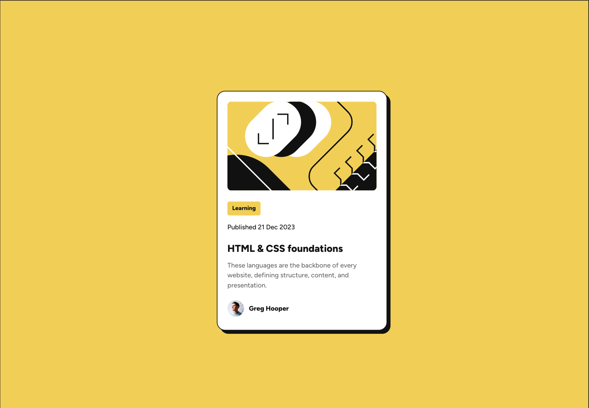

# Frontend Mentor - Blog preview card solution

This is a solution to the [Blog preview card challenge on Frontend Mentor](https://www.frontendmentor.io/challenges/blog-preview-card-ckPaj01IcS). Frontend Mentor challenges help you improve your coding skills by building realistic projects. 

## Table of contents

- [Overview](#overview)
  - [The challenge](#the-challenge)
  - [Screenshot](#screenshot)
  - [Links](#links)
- [My process](#my-process)
  - [Built with](#built-with)
  - [What I learned](#what-i-learned)
  - [Continued development](#continued-development)
  - [Useful resources](#useful-resources)
- [Author](#author)

## Overview
### The challenge

Users should be able to:

- See hover and focus states for all interactive elements on the page

### Screenshot

The desired design:

My solution:


### Links

- Solution URL: [my solution on Netlify](https://netlify.com)

## My process

### Built with

- Semantic HTML5 markup
- CSS custom properties
- Flexbox
- CSS Grid

### What I learned

I learned how to create and utilize custom CSS variables by making a :root pseudo-class, like the following:


```css
:root {
  /* Colors */
  --yellow: hsl(47, 88%, 63%);
  --white: hsl(0, 0%, 100%);
  --gray-500: hsl(0, 0%, 42%);
  --gray-950: hsl(0, 0%, 7%);
}

body {
  background-color: var(--yellow);
}
```

### Continued development

I'm still having difficulty with sizing of components like the card I created, especially with the mobile design aspect. I wasn't able to give it enough margin/space around it. I'd like to be able to master this in the near future!

### Useful resources

- [LogRocket Frontend Analytics](https://blog.logrocket.com/how-to-use-css-variables-like-a-pro/) - This is an amazing article which helped me finally understand and implement custom CSS variables through the :root pseudo-class. I'd recommend it to anyone unfamiliar with it or wants to try out custom CSS variables.

## Author

- Website - [Add your name here](https://www.your-site.com)
- Frontend Mentor - [@yourusername](https://www.frontendmentor.io/profile/yourusername)
- Twitter - [@yourusername](https://www.twitter.com/yourusername)

